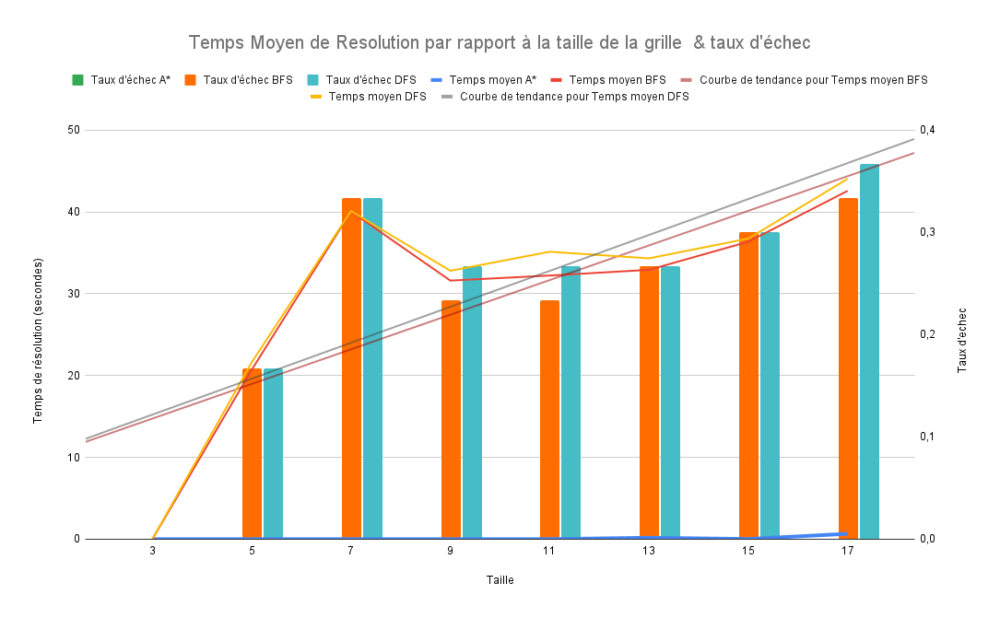
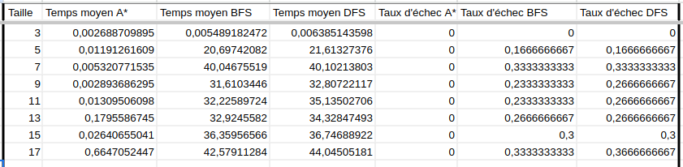

# Résolution du Taquin par algorithmes de recherche

## Générer les données

1. Génèrer les puzzles

On génère des puzzles taquin random de la taille 3 à 17 (avec 2 incréments), et des maxlengths de 1 à 45.
Le détail est dans le fichier generate_custom_npuzzle qui s'inspire largement du fichier donné generate_npuzzle.

Les puzzles générés sont stockés dans le dossier `puzzlez`.

```
python generate_npuzzle.py
```

2. Créer le fichier CSV 

On crée le fichier csv `benchmark_results.csv` à partir des puzzles du dossier `puzzlez`. Le timeout par défaut est de 120 secondes.

```
python generate_data_csv.py
```

## Consulter les graphiques

Nous avons généré différents graphiques à partir des données sur google sheets.

Pour voir les détails vous pouvez accéder au [lien du fichier pour voir/éditer](https://docs.google.com/spreadsheets/d/1ZHJkv11eW2VT8pca6hSxutpdCd5TWnT9HfM9MQNT3RA/edit?usp=sharing) les formules et données des graphes.
On peut avant tout observer que le graphe ci-dessous ne présente pas les nombres de mouvements attendus, car cette donnée, étant réitérée pour chaque taille de terrain, rend les moyennes indépendantes par rapport à ce paramètre. En revanche, bien qu'elles n'apparaissent pas, ces données auraient pu révéler un biais majeur dans nos résultats et expliquer l’aspect surprenant de ces courbes. En effet, les puzzles ont été testés avec moins d’une centaine de mouvements, ce qui reste globalement gérable pour les algorithmes DFS et BFS, que l’on s’attendait à voir échouer bien plus fréquemment sur des terrains de grande taille. À titre indicatif, un taquin de 15×15, dont la configuration est tirée uniformément et avec une solution, demande en moyenne un millier de mouvements pour être résolu. Notre algorithme de test est donc très insuffisant pour illustrer l’explosion de complexité.

Toutefois, des modifications ont été apportées au fichier de génération de puzzles afin de corriger ce problème, mais le temps nous a manqué pour relancer un benchmarking.

Voici tout de même les graphiques obtenus. On peut déjà observer une grande efficacité de A* face aux autres algorithmes, qui voient leur complexité augmenter très rapidement, ainsi que leur taux d’échec (timeout à 120 secondes).
Il est à noter que les temps moyens de résolution incluent également les durées de timeout, à condition qu’au moins un des algorithmes ait résolu le puzzle.



Ici on a les données exactes des moyennes selon les tailles du taquin:




**Edition du google sheet:**

1. Se rendre sur le [fichier](https://docs.google.com/spreadsheets/d/1ZHJkv11eW2VT8pca6hSxutpdCd5TWnT9HfM9MQNT3RA/edit?usp=sharing).
2. Coller les données dans la feuille **benchmark_csv**
3. Remplacer les `.` par des `,` (sinon risque d'erreur)
